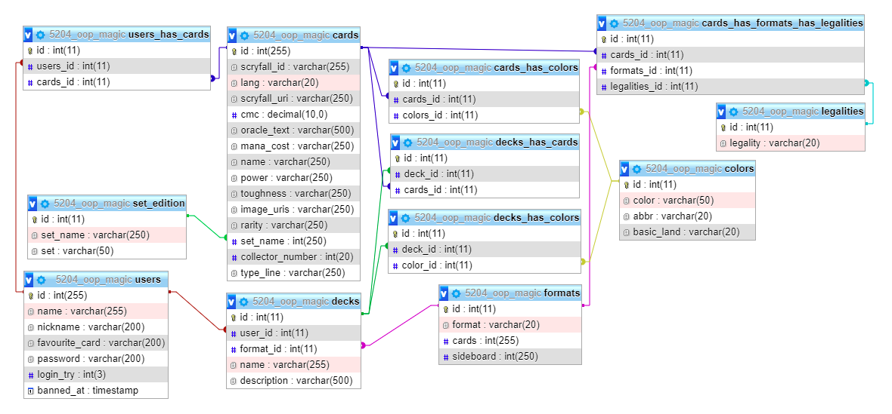

# 5204 PHP Web application WDD19 Laura Lea Müller 
SAE Institute Zurich, Submission date Apr, 29. 2021
***
## Table of Contents
* [Infos for the Teacher](#teacher-info)
* [Overview](#overview)
* [Project structure](#project)
* [Database structure](#database)
* [Installation and system ](#installation)
* [Folder structure](#folder-structure)
* [Conclusion](#conclusion)
* [source directory](#source-directory)
  
## Infos for the Teacher
**Database**

_The file to create the Database is in this folder:_

    Database:
    5204_php / database / config / 5204_oop_magic.sql

**Login**

_These are the data to log into my website in the backend as a user:_

    Login:
    nickname: teacher PW: oop5204

The website can also be found online at [magic.webtatze.ch](https://magic.webtatze.ch/index?p=home).    

**Files & Folders**

_In every PHP file at the top you find a description what this file does._  
_The folder structure is created by the MVC model. 
To understand the folder structure please read the section [Project structure](#project)
and the [Folder structure](#folder-structure) in the README.md._
***

## Overview 
**Project Magic Decks**

For this school project i had to program a web application by myself.
I have decided to do a page for Magic the Gathering Players.  
The Players can log in create Decks and save them. 
The Players can log in create Decks and save them. 
Registered players as well as unregistered persons are able to view decks of other players.  
Here is an explanation of the game [Magic the Gathering ](https://media.wizards.com/images/magic/resources/rules/EN_MTGM14_Rulebook_LR.pdf).
***

## Project structure
**MVC & twig**  
The Project is build by the MVC model. Here is a simple[ MVC explanation ](https://www.educative.io/blog/mvc-tutorial).  
 In Regarding of the MVC model there is also an AbstractModel.php and an AbstractView.php in which there are functions that all Models/ Views use. 
 For the complex search and filter functions,
 I have also created a Model that does not use the AbstractModel.php (SearchCardsModel.php/ SearchDecksModel.php/ ApiModel.php).  
 In addition, this project was created with the template system [twig](https://twig.symfony.com/doc/3.x/).  
 The Magic API is checked manually and supplemented by the bulk data of the Scyfallapi.

***

## Database structure

***

## Installation and system  
**In this project the following languages and libraries were used:**
 * PHP / OOP
 * js and jquery
 * css/ scss
 * HTML5
 * gulp
 * Bootstrap
 * Composer (namespaces)
 * twig (template system)
 * git
 * [scryfall API](https://scryfall.com/docs/api)
 
To edit or change the project open gitBash or any other console in the root folder.

In case you haven't already installed npm,node.js,PHP and composer globally, please do that first.  
 [link to install npm via node.js ](https://www.npmjs.com/get-npm)  
 [link to install php ](https://www.php.net/downloads)  
 [link to install composer ](https://getcomposer.org/download/)  

   if you are not sure about it run `node -v`, `npm -v`, `php -v` and `composer -v` this will tell you which version you have installed, or otherwise if it is not available.

Run `npm install` this command will run the package.json file and thus install gulp and Bootstrap.  
It will create a folder named node_modules.  
Run `composer install` this command will run the composer.json file and thus install twig.  
It will create a folder named vendor.

Because scss is used here, a watcher must be activated if you want to change scss/css. Run `gulp watch`  
 this will now automatically open a browser with a live server of the project template.
this command will run the gulpfile.js file and inside it the watch function.

What the watcher actually does is:
* it watches for changes in the scss files, takes the scss files, changes those to css add autoprefix an saves them in the css folder
* it takes the created css in the css folder and uglify the file , before it saves it in the min_css folder
* it watches for changes in the html files and updates the live server on it.
* it watches for changes in the js files and updates the live server on it.

The composer i need for namespaces and the template system twig.  
 [namespaces use explained](https://jtreminio.com/blog/composer-namespaces-in-5-minutes/)  
 [namespaces detailed explained](https://code.tutsplus.com/tutorials/how-to-autoload-classes-with-composer-in-php--cms-35649)  
 [twig for Developers](https://twig.symfony.com/doc/3.x/api.html)  
 [twig for template Designers](https://twig.symfony.com/doc/3.x/templates.html)  

Now you can work on this project.
The watcher (gulp) is actually just for templating.
With PHP the whole thing gets a bit more complicated, That's why I did the whole templating with style before I started with PHP. 
and then only added minor changes.  
I tried to use git after fitflow, it worked more or less well. I left out the release branch.  

***

## Folder structure 
**The folder structure by MVC**  

1. `5204_php` = is the root folder. Folders:
   + `Controllers` = contains all the files which controls something.
   + `css` = finished css files  
   + `Database` = contains the connection files for the DB.
   + `fonts` = contains all the used fonts.
   + `Helpers` = contains helper files.
   + `img` = contains all images.
   + `js` = contains .js files.
   + `min_css` = contains the min css file.
   + `Models` = contains files which does something in the Database.
   + `node_modules` = contains files and folders from the node.
   + `scyfallApi` = contains the Json file for the cards.
   + `scss` = contains all .scss files.
   + `templates` = contains every file that outputs some HTML.
   + `vendor` = contains files and folders from composer.
   + `Views` = contains files who includes files from template.

2. `5204_php` = is the root folder. Files:
   + .gitignore = tells git which files or folders it should ignore.
   + .htacces = removes the .php ending in the URL.
   + bootstrap.php = its needed for the autoload (namespace) function from composer.
   + composer.json = contains instructions for composer.
   + composer.lock = auto generated file from composer.
   + gulpfile.js = it contains the functions and instructions for gulp.
   + index.html = it contains the template.
   + index.php = its the main file for the website.
   + package.json = contains instructions for node.
   + package-lock.json = auto generated file from node.
   + README.md = contains everything that is important to work on this project.
 
***

## Conclusion 
**Generally**  
Looking back, I would have chosen something for this project that is not that complex.  
For example, I would load the legalities via the api and not in the relational database with a triple key. this alone would have saved me a lot of time and effort. 
But now I'm also happy because I've learned a lot. 
  
**Additions which I would have liked to have added**
 + comment function for decks of other users
 + a folder system to sort the stored cards
 + a direct display when adding a card in which decks it is legal
 + a direct display when adding a card in which decks it is allowed in terms of color
 + a direct display when adding a card in which decks it is already present and how often
 + the possibility to add a card to the sideboard of the deck  
  
   
***

## source directory 
**Pictures**  
Nearly all of the pictures come from the [scryfall API](https://scryfall.com/docs/api).

only 2 are not, i got them form:
* [blog.gate-to-the-games.de](https://blog.gate-to-the-games.de/magic-booster-battle-limited-in-ganz-einfach/) 
* [icon-library.com](https://icon-library.com/icon/mana-icon-22.html) 

